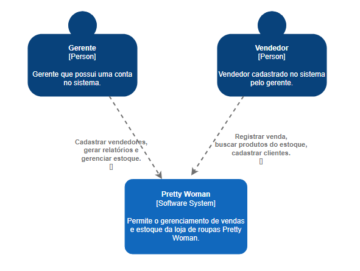
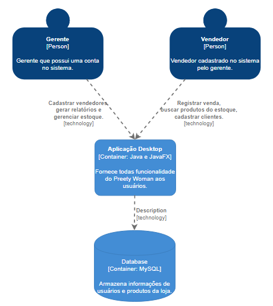

<h1 align="center"> Pretty Woman </h1>

<h2> Sobre </h2>

 Com o intuito de facilitar e aprimorar o cotidiano dos usuários envolvidos em uma loja de roupas, o sistema Pretty Woman envolve todas as necessidades em um só lugar e de maneira digital. o sistema pretende realizar tarefas como controle de estoque, gerenciamento de produtos e gerenciamento de clientes de maneira rápida e eficiente. 

<h2> C4 Model </h2>

 O modelo C4 foi é um conjunto de diagramas baseado em camadas, estabelecido para descrever a arquitetura de um software em diferentes níveis de abstração e detalhes 

 Como o próprio nome diz, são 4 modelos diferentes de diagramas: diagrama de contexto, container, componentes e código. 

 A seguir, os diagramas do projeto Pretty Woman. 

<h3><li> Diagrama de contexto </li></h3>

 O diagrama de contexto retrata o contexto em que o software está inserido, ou seja, quem irá utilizá-lo e com quais outros softwares interage. 

<h3><li> Diagrama de container </li></h3>

 O diagrama de container representa a arquitetura do projeto, exibindo quais são as tecnologias utilizadas e como elas se comunicam. 

<h3> Continua... </h3>

<h3> Integrantes </h3>
<li> Ana Jéssica de Goes Jorge </li>
<li> Leonardo Vietro </li>
<li> Melyssa Ferreira da Silva </li>
